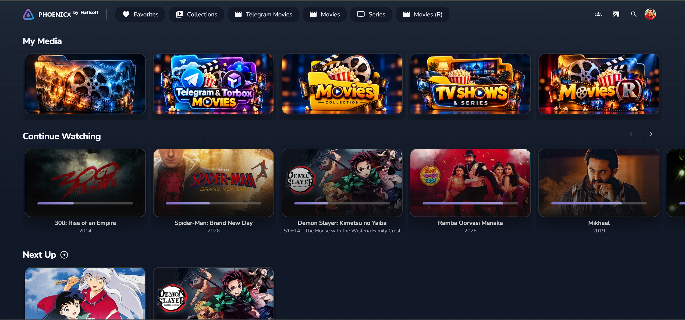
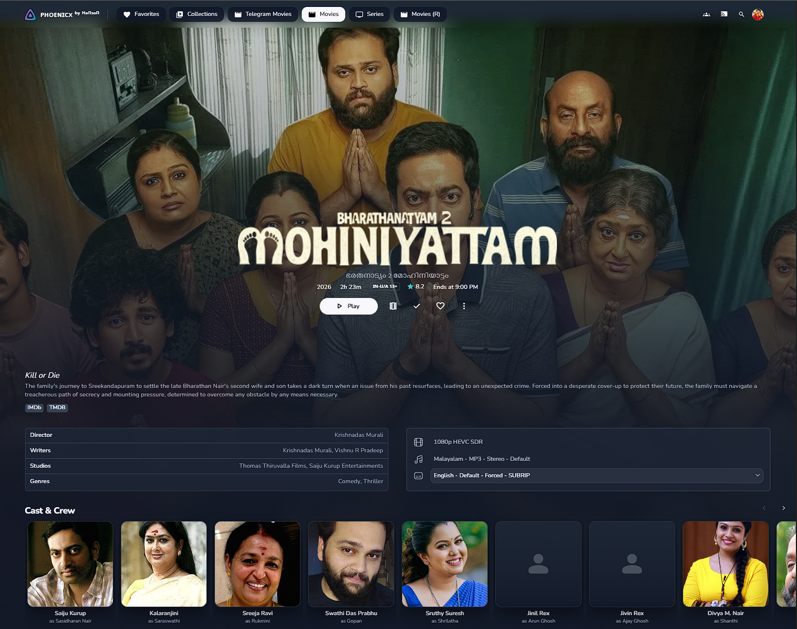

<div align="center">

# 🎬 PHOENICX CINEMA

### Signature Edition · v2.0

**A cinematic, modern, dark interface for Jellyfin.**

*Smooth movie cards · Frosted-glass surfaces · Lavender accents · Media Bar styling*


**Your library. Your screen. Your cinema.**

</div>

---

## ✨ Overview

**PHOENICX CINEMA** gives the Jellyfin web interface a refined, cinema-inspired look, with rounded media cards, a dark color palette, soft shadows, frosted-glass surfaces, and styling for a home-screen Media Bar slideshow.

It is available as **one combined CSS file**. You don't need to import separate upstream theme stylesheets.

> [!NOTE]
> Media Bar styling is included, but the CSS does **not** install the Media Bar plugin or create a slideshow by itself. You'll need a compatible Media Bar plugin, installed and configured separately, to use that feature.

## 🖼️ Preview

### Home Screen



### Movie Details




## 🌟 Features

| Feature | What it changes |
| --- | --- |
| 🎞️ Cinematic home screen | Gradient overlays and Media Bar slideshow styling |
| 🪟 Frosted-glass interface | Header, menus, dialogs, and floating panels |
| 🍿 Movie and series cards | Rounded artwork, shadows, and desktop hover effects |
| 💜 Lavender accents | Highlights, buttons, focus outlines, and progress bars |
| 🔤 Refined typography | Nunito-based styling with font fallbacks |
| ▶️ Playback actions | Rounded buttons and prominent play controls |
| 📱 Responsive design | Adjustments for smaller screens and portrait layouts |
| ♿ Accessibility details | Visible focus states and reduced-motion support |
| 📦 All-in-one CSS | No separate upstream theme CSS imports required |

## 🚀 Installation

Choose **one** of the following methods. Back up any existing Custom CSS first.

### Option A — Install via jsDelivr CDN (easy updates)

1. Open Jellyfin in your browser and sign in as an administrator.
2. Go to **Dashboard → General → Custom CSS** (the setting's location may vary by Jellyfin version).
3. Paste this into the Custom CSS field:

   ```css
   @import url("https://cdn.jsdelivr.net/gh/hansonds/Phoenicx-Cinema-Theme@main/PHOENICX_CINEMA_SIGNATURE_v2_CLEAN.css");
   ```

4. **Save** your changes.
5. Refresh your browser with **Ctrl + Shift + R**, or clear the site's cache if necessary.

The CDN loads the CSS from this repository's `main` branch. Updates may take time to appear because of CDN caching.

### Option B — Install manually (no theme CDN dependency)

1. Open [`PHOENICX_CINEMA_SIGNATURE_v2_CLEAN.css`](PHOENICX_CINEMA_SIGNATURE_v2_CLEAN.css).
2. Click **Raw** and copy the entire CSS file.
3. In Jellyfin, open **Dashboard → General → Custom CSS**.
4. Replace your previous theme CSS with the copied code.
5. **Save** and refresh the browser.

This method avoids fetching the theme stylesheet from a CDN, but any external font assets referenced by the CSS may still require internet access.

> [!IMPORTANT]
> Avoid stacking other complete Jellyfin themes on top of PHOENICX CINEMA. Their selectors may conflict and cause visual or layout problems.

## 🎛️ Customization

PHOENICX CINEMA defines variables for its main colors and visual style:

```css
:root {
    --px-background: #090b12;
    --px-surface: #151925;
    --px-accent: #a69cff;
    --px-accent-light: #cbc4ff;
    --px-text: #f7f7fc;
    --px-card-radius: 15px;
    --px-panel-radius: 20px;
}
```

**Using the CDN?** Add overrides **after** the import in Jellyfin's Custom CSS field:

```css
@import url("https://cdn.jsdelivr.net/gh/hansonds/Phoenicx-Cinema-Theme@main/PHOENICX_CINEMA_SIGNATURE_v2_CLEAN.css");

:root {
    --px-accent: #a69cff;
    --px-accent-light: #cbc4ff;
}
```

> [!NOTE]
> Some inherited theme elements use their own design tokens. Changing a `--px-*` value may not affect every component.

## 🧩 Compatibility and requirements

- **Jellyfin Web:** designed for Jellyfin's modern web interface, with Jellyfin 12 layout adaptations included.
- **Media Bar:** slideshow styling requires a compatible Media Bar plugin and configuration.
- **Browsers:** modern Chromium-based browsers are a good starting point; other browser behavior may vary.
- **Native apps:** only apps that render and accept Jellyfin Web custom CSS will show these changes. Do not expect every native TV or mobile client to be themed.
- **Fonts:** the stylesheet includes references to Google Fonts/font assets. Some fonts may fall back when offline.

**Compatibility is not guaranteed** across every Jellyfin version, plugin release, browser, or device. Check the interface after updates.

## 🛠️ Troubleshooting

| Issue | Suggested fix |
| --- | --- |
| Previous styling still appears | Hard-refresh the browser; clear cached site assets if necessary |
| Cards or menus look incorrect | Remove conflicting CSS or other themes and test again |
| Slideshow is missing | Check Media Bar plugin installation, compatibility, and configuration |
| Text uses a different font | Confirm font asset connectivity; browser fallback fonts may be active |
| CDN styles don't update | Allow for jsDelivr caching or use the manual installation method |
| Mobile/TV layout looks different | Test in Jellyfin Web; client CSS support varies |

To revert, remove the import or pasted stylesheet from **Custom CSS**, restore your backup if applicable, save, and refresh.

## 📁 Repository files

```text
Phoenicx-Cinema-Theme/
├── README.md
├── PHOENICX_CINEMA_SIGNATURE_v2_CLEAN.css
├── PHOENICX_CINEMA_THIRD_PARTY_NOTICES.txt
└── screenshots/
    ├── home.png
    └── details.png
```

## 🙌 Credits and third-party notices

PHOENICX CINEMA combines customizations with third-party Jellyfin theme code, including:

- **ElegantFin** by **lscambo13**
- **Media Bar Plugin Support** add-on by **lscambo13**
- **ElegantFin for Jellyfin 12 Modern** by **mihaif7** ([upstream repository](https://github.com/mihaif7/elegantfin-jf12))

See [`PHOENICX_CINEMA_THIRD_PARTY_NOTICES.txt`](PHOENICX_CINEMA_THIRD_PARTY_NOTICES.txt) for attribution and license information. Original authors retain their rights. Follow all applicable upstream license requirements when redistributing the combined stylesheet.

---

<div align="center">

### 💜 PHOENICX CINEMA

**Your library. Your screen. Your cinema.**

*Built for a more immersive Jellyfin experience.*

</div>
